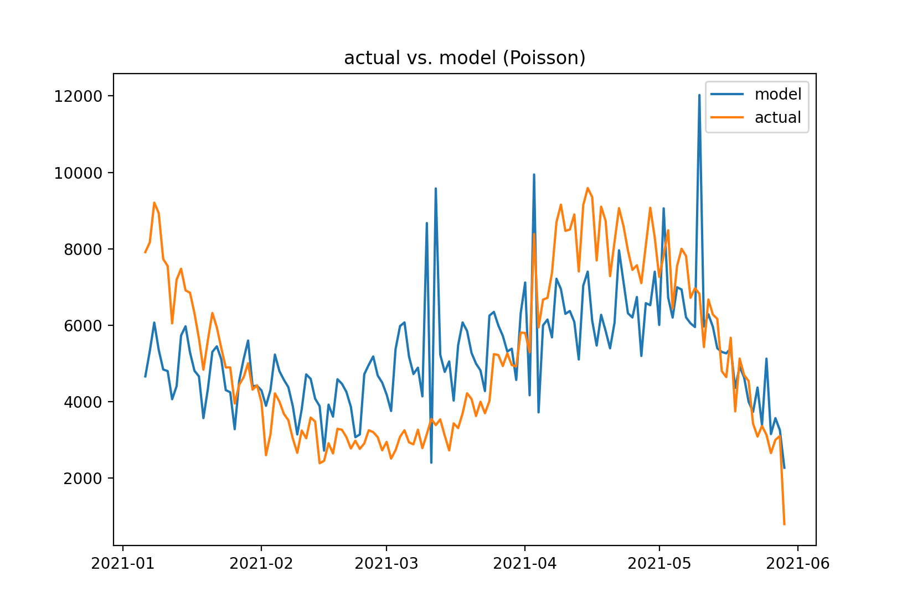

# COVID-19-analysis

## Some basic analysis and simple predictions on the COVID-19 data in Canada
- Data source: https://docs.google.com/spreadsheets/d/1PjkemMdFSZgA-M8Esr6rbNjHiyfcXcBxPeMjselJIso/edit#gid=669830005
- Table of Content (An overview of the project):
  - Import the data and conduct data cleaning:
  ```python
  def data_cleaning(data):
    data.rename(columns={c: repl(c.strip()) for c in data.columns}, inplace=True)
    del data['province']
    del data['last_updated']
    data = data.set_index('date')
    return data.dropna()
  
  def repl(name):
    match = re.search('(^data » )([\w]*)', name)
    return match.group(2) if match else name
  
  # load and clean the data only for 'National' in the dataset:
  national = data_cleaning(pd.read_excel(link, sheet_name='National'))
  ```
  
  - Prediction: Poisson regression on the data of the entire country:
  
  ```python
  ds = national.index.to_series()
  national['MONTH'] = ds.dt.month
  national['DAY_OF_WEEK'] = ds.dt.dayofweek
  national['DAY'] = ds.dt.day
  formula = """change_cases ~ DAY + DAY_OF_WEEK + MONTH + change_vaccinated + change_tests"""
  y, X = dmatrices(formula, national, return_type='dataframe')
  poisson_reg = sm.GLM(y, X, family=sm.families.Poisson()).fit()
  ```
  
  - Comparison across different states
  - [Code](covid-19_ca.py)
  - Results and graphs:
  
  The first image is the plot of actual COVID-19 cases in Canada against the model predicted values. This Possion regression model somehow captures the dynamic of   changes of COVID-19 cases number.
  
  
  
  The summary of above model is:
```
  Generalized Linear Model Regression Results                  
  ==============================================================================
  Dep. Variable:           change_cases   No. Observations:                  144
  Model:                            GLM   Df Residuals:                      138
  Model Family:                 Poisson   Df Model:                            5
  Link Function:                    log   Scale:                          1.0000
  Method:                          IRLS   Log-Likelihood:                -38659.
  Date:                Fri, 04 Jun 2021   Deviance:                       75832.
  Time:                        00:08:40   Pearson chi2:                 7.36e+04
  No. Iterations:                     5                                         
  Covariance Type:            nonrobust                                         
  =====================================================================================
                          coef    std err          z      P>|z|      [0.025      0.975]
  -------------------------------------------------------------------------------------
  Intercept             7.4900      0.006   1179.253      0.000       7.478       7.502
  DAY                   0.0025      0.000     17.462      0.000       0.002       0.003
  DAY_OF_WEEK          -0.0012      0.001     -2.095      0.036      -0.002   -8.03e-05
  MONTH                 0.1069      0.001    102.579      0.000       0.105       0.109
  change_vaccinated -1.069e-05   1.29e-07    -82.958      0.000   -1.09e-05   -1.04e-05
  change_tests       7.375e-06   4.02e-08    183.278      0.000     7.3e-06    7.45e-06
  =====================================================================================
```
  
  All the predictors (```DAY```, ```DAY_OF_WEEK```, ```MONTH```, ```change_vaccinated```, ```change_tests```) are significant on the significance level of             alpha=0.05 since their p-values all close to 0.

 
 - [Dashboard](https://public.tableau.com/app/profile/yangzixuan5243/viz/COVID-19CanadaViz/Dashboard1)
  
  Finally, here is a Dashboard made from Tableau Public on the original dataset.
   
